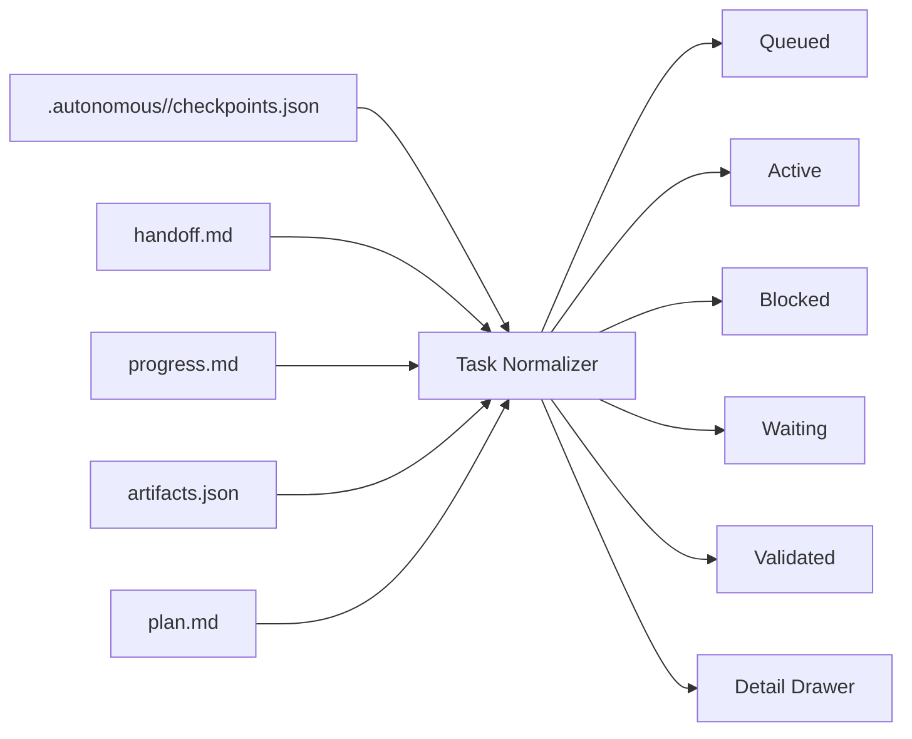

# Campfire Board Spec

## Purpose

`campfire-board` is a local dashboard for visualizing Campfire task state without reading raw task files or chat history.

The board should make long-running Codex work legible at a glance:

- what task is active
- which milestones are queued next
- whether the run is healthy, blocked, or waiting on a decision
- what evidence was produced
- what prompt should be used to resume the task

This is a visibility layer over Campfire state, not a replacement for the Codex App.

## Goals

- Read Campfire task state directly from `.autonomous/<task>/`
- Show a board view across one repo or many repos
- Prefer `checkpoints.json` as the canonical structured source
- Surface `handoff.md`, `progress.md`, and `artifacts.json` as operator-facing detail
- Refresh automatically when task files change
- Stay useful even when Codex is not actively running

## Non-Goals

- Do not replace the Codex App thread UI
- Do not require Codex App Server for the MVP
- Do not mutate task state in the first version
- Do not become a generic project-management tool
- Do not add a database for the MVP

## Primary Users

- The operator who wants to check whether a long-running Codex task is healthy
- The maintainer who wants to inspect milestone history and validation evidence
- The reviewer who wants to understand why a task stopped

## Source Files

The MVP assumes each Campfire task follows the current task-state contract:

- `.autonomous/<task>/checkpoints.json`
- `.autonomous/<task>/handoff.md`
- `.autonomous/<task>/progress.md`
- `.autonomous/<task>/artifacts.json`
- `.autonomous/<task>/plan.md`
- `.autonomous/<task>/findings/`

### Canonical Structured Source

`checkpoints.json` is the primary source for:

- task status
- current milestone
- queued milestones
- execution mode and run style
- blocker state
- validation summary
- last run stop reason
- last run events
- workspace metadata

### Secondary Sources

- `handoff.md`: concise operator summary and resume prompt
- `progress.md`: human timeline for recent milestones and validation
- `artifacts.json`: evidence index
- `plan.md`: stable objective and milestone checklist
- `findings/`: evaluation notes and investigation summaries

## Derived Board States

The board should derive visible swimlanes from task state, not rely on custom board-only metadata.

### Task Columns

- `Queued`
  - task has queued milestones but no active work right now
- `Active`
  - `status` is `in_progress`
- `Blocked`
  - `status` is `blocked` or `blocker.status` is active
- `Waiting`
  - `status` is `waiting_on_decision`
- `Validated`
  - `status` is `validated`

### Card Badges

- `bounded` or `until_stopped`
- queue depth
- last stop reason
- last run event count
- blocker type
- stale state warning when `last_updated` is older than a threshold

### Health Signals

- `Healthy`
  - active or queued, recent updates, no blocker
- `Needs Reframe`
  - active task with low queue depth and no blocker
- `Blocked`
  - blocker present
- `Waiting on Decision`
  - decision boundary present
- `Stale`
  - no updates beyond configured age

## MVP UI

### Layout

- top bar
  - repo selector
  - refresh indicator
  - filter controls
- left sidebar
  - discovered repos or workspace roots
  - task counts by state
- main board
  - kanban-style columns for `Queued`, `Active`, `Blocked`, `Waiting`, `Validated`
- detail drawer
  - opens when a task card is selected

### Task Card Fields

- task slug
- objective summary
- current milestone id and title
- queued milestone count
- run style
- last stop reason
- last updated timestamp
- validation summary

### Detail Drawer Sections

- `Overview`
  - objective
  - current status
  - active milestone
  - execution policy summary
- `Queue`
  - current milestone plus ordered queued milestones
- `Evidence`
  - artifact list from `artifacts.json`
  - links to findings and evaluation notes
- `Handoff`
  - rendered `handoff.md`
  - copyable resume prompt
- `Progress`
  - recent entries from `progress.md`
- `Plan`
  - milestone checklist from `plan.md`

### Suggested Visual Language

- board-first, not document-first
- compact cards with readable status chips
- clear distinction between terminal stop reasons and mid-run events
- evidence and prompt actions visible without opening raw files

## Data Model

The UI should normalize each task into a view model like:

```ts
type TaskBoardItem = {
  repoRoot: string
  taskSlug: string
  objective: string
  status: "ready" | "in_progress" | "blocked" | "waiting_on_decision" | "validated"
  currentMilestone: { id: string; title: string } | null
  queuedMilestones: { id: string; title: string }[]
  execution: {
    mode: "single_milestone" | "rolling"
    runStyle: "bounded" | "until_stopped"
    planningSliceMinutes: number | null
    runtimeBudgetMinutes: number | null
    targetQueueDepth: number | null
  }
  blocker: {
    status: string | null
    type: string | null
    summary: string | null
    attempts: number | null
  } | null
  validation: {
    type: string | null
    summary: string | null
    timestamp: string | null
  } | null
  lastRun: {
    stopReason: string | null
    events: string[]
    summary: string | null
  }
  handoff: {
    nextSlice: string | null
    resumePrompt: string | null
  }
  artifacts: {
    path: string
    kind: string
    reason: string
  }[]
  lastUpdated: string | null
}
```

## Architecture

### Recommendation

Use a local web app first:

- frontend: `React + TypeScript + Vite`
- backend: lightweight Node server
- refresh: filesystem watch plus SSE or WebSocket push

### Why This Stack

- easier than Electron for the first version
- no Codex App or App Server dependency
- easy to point at one or more repo roots
- portable across Campfire users
- easy to evolve into a desktop wrapper later if needed

### Backend Responsibilities

- discover `.autonomous/*` under configured repo roots
- parse Campfire task files
- normalize them into a stable API shape
- watch for file changes
- publish updates to the frontend

### Frontend Responsibilities

- render board columns from normalized tasks
- maintain filters and sorting
- render markdown detail sections safely
- provide copy/open actions for prompt and file references

## Repo Discovery

The MVP should support:

- one explicit repo root
- a list of repo roots from config or CLI args

Optional later support:

- auto-discover Campfire repos in a parent directory
- remember recently opened repos

## Refresh Model

### MVP

- initial full scan on load
- file watcher on `.autonomous/**`
- debounce updates into one board refresh event

### Fallback

- polling every few seconds when watcher support is unavailable

## File Parsing Rules

- fail soft when optional files are missing
- mark tasks as `incomplete_state` in the UI if required files are missing
- preserve raw parse errors for the detail drawer
- prefer resilient markdown parsing over strict formatting assumptions

## Actions

The MVP should provide read-oriented actions only:

- copy resume prompt
- open task directory
- open `handoff.md`
- open `checkpoints.json`
- open the latest finding or artifact

Later actions can include:

- open task in Codex App
- create task from objective
- trigger verifier scripts

## Example Board Mapping



## MVP Milestones

### Milestone 1: Parser and API

- discover Campfire tasks under one repo root
- parse `checkpoints.json`, `handoff.md`, and `artifacts.json`
- expose normalized JSON over a local API
- add deterministic parser tests for representative task states

### Milestone 2: Board UI

- render board columns and task cards
- show detail drawer with handoff, queue, and evidence
- support repo-level filters and stale-task highlighting

### Milestone 3: Live Refresh

- add file watching
- push task updates to the browser
- show update status and parse failures

### Milestone 4: Multi-Repo View

- support multiple repo roots
- show repo grouping and task counts
- preserve selected task while data refreshes

## Post-MVP

- package as Electron or Tauri if a desktop app feels better than browser-only
- add optional Codex App Server integration for live thread and approval visibility
- correlate task state with git branch or worktree info
- render run-event timeline from `last_run.events`
- add verifier history and trend views

## Why Not App Server First

Campfire already stores the durable state needed for a board on disk.

That means the first useful version can ship without:

- a custom Codex client
- App Server thread handling
- auth flows
- approval streaming

App Server becomes attractive later if the board needs:

- live Codex thread status
- streaming turn events
- approval controls
- custom resume or fork actions

## Open Questions

- Should the board live inside this repo or in a separate `campfire-board` repo?
- Should the MVP ship as a local dev tool or as a packaged desktop app?
- Do we want file-open integration for Codex App, VS Code, or both?
- Should stale-task thresholds be global or per repo?
- Do we want to visualize a single task as a milestone board in addition to the task-level board?
